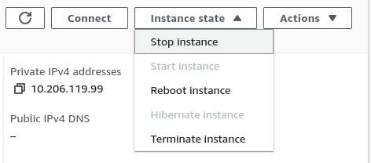

# etcdMembersDown

## Meaning

This alert fires when one or more etcd member goes down and evaluates the
number of etcd members that are currently down. Often, this alert was observed
as part of a cluster upgrade when a master node is being upgraded and requires a
reboot.

## Impact

In etcd a majority of (n/2)+1 has to agree on membership changes or key-value
upgrade proposals. With this approach, a split-brain inconsistency can be
avoided. In the case that only one member is down in a 3-member cluster, it
still can make forward progress. Due to the fact that the quorum is 2 and 2
members are still alive. However, when more members are down, the cluster
becomes unrecoverable.

## Diagnosis

Login to the cluster. Check health of master nodes if any of them is in
`NotReady` state or not.

```console
oc get nodes -l node-role.kubernetes.io/master=
```

Check if an upgrade is in progress.

```console
oc adm upgrade
```

In case there is no upgrade going on, but there is a change in the
`machineconfig` for the master pool causing a rolling reboot of each master
node, this alert can be triggered as well. We can check if the
`machineconfiguration.openshift.io/state : Working` annotation is set for any of
the master nodes. This is the case when the [machine-config-operator
(MCO)](https://github.com/openshift/machine-config-operator) is working on it.

```console
oc get nodes -l node-role.kubernetes.io/master= -o template --template='{{range .items}}{{"===> node:> "}}{{.metadata.name}}{{"\n"}}{{range $k, $v := .metadata.annotations}}{{println $k ":" $v}}{{end}}{{"\n"}}{{end}}'
```

### General etcd health

To run `etcdctl` commands, we need to `rsh` into the `etcdctl` container of any
etcd pod.

```console
oc rsh -c etcdctl -n openshift-etcd $(oc get pod -l app=etcd -oname -n openshift-etcd | awk -F"/" 'NR==1{ print $2 }')
```

Validate that the `etcdctl` command is available:

```console
etcdctl version
```

Run the following command to get the health of etcd:

```console
etcdctl endpoint health -w table
```

## Mitigation

If an upgrade is in progress, the alert may automatically resolve in some time
when the master node comes up again. If MCO is not working on the master node,
check the cloud provider to verify if the master node instances are running or not.

### Restarting Instance in AWS

If the master node is unhealthy you can try stop/starting the instance
in AWS.  Log into the AWS account of the cluster and find the instance of
the affected master node by searching the running ec2 instances by the node
name.  Click the instance and at the top right select "Instance state", and
"Stop instance."  After the instance stops you can repeat the process and
choose "Start instance."


