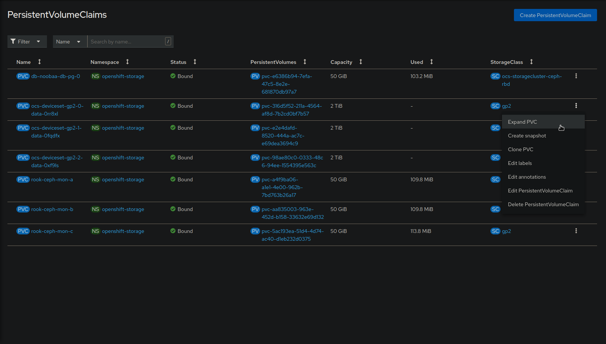
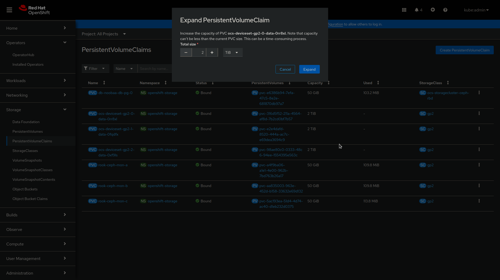

# PersistentVolumeUsageNearFull

## Meaning

Persistent Volume Claim (PVC) usage has exceeded 75% of its capacity,
indicating an imminent risk of reaching full capacity.

## Impact

**Severity:** Warning
**Potential Customer Impact:** High

This alert signifies that a PVC is nearing its full capacity, potentially
leading to data loss if not addressed promptly.

## Diagnosis

The alert triggers when a Persistent Volume Claim (PVC) approaches or surpasses
75% of its capacity. It indicates the need to expand the PVC size to accommodate
more data or to remove unnecessary data to free up space.

**Prerequisites:** [Prerequisites](helpers/diagnosis.md)

## Mitigation

### Recommended Actions

- **Expand the PVC Size:** Increase the capacity of the PVC to prevent data loss.
  
  
  
- **Delete Unnecessary Data:** Remove unnecessary data occupying space in the PVC.
