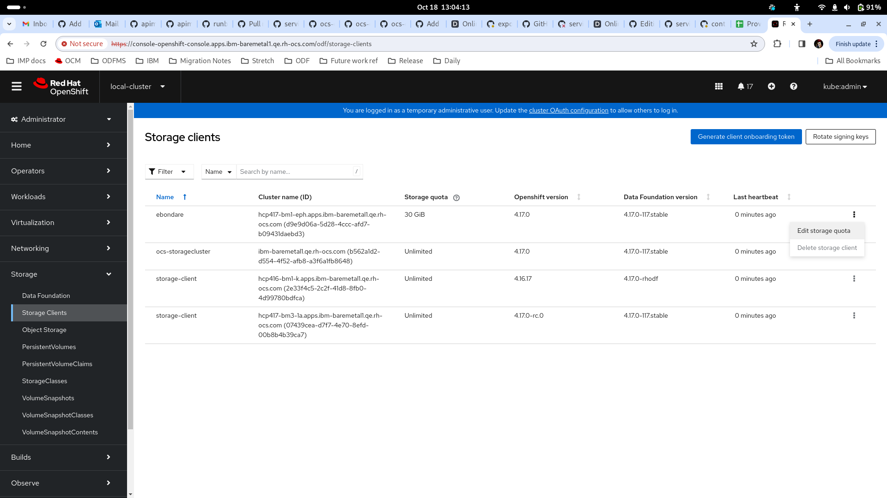
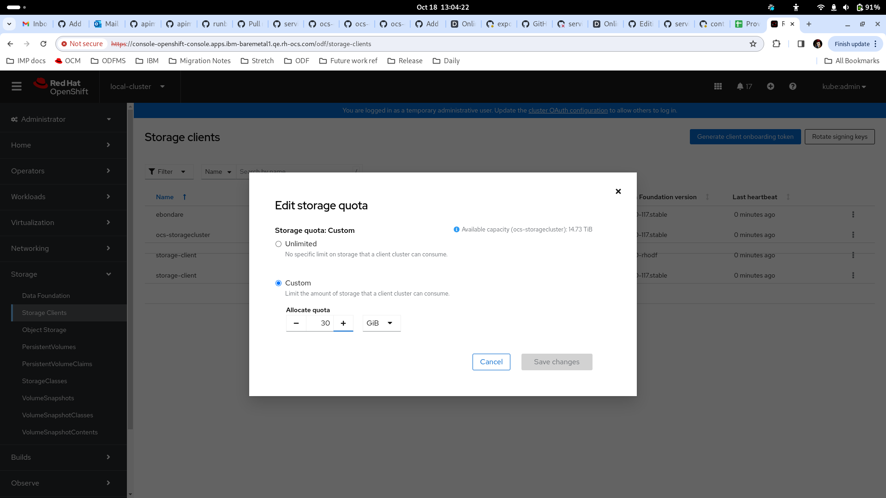

# StorageQuotaUtilizationThresholdReached

## Meaning

Persistent Volume (PV) usage is alarmingly high and might reach the
allotted quota soon. Please see the alert documentation text for an
exact threshold limit.

## Impact

This alert signifies that the storage utilization on the ODF client is
close to reaching the configured storage quota, potentially leading to
blocking the creation of new PVs on the client's cluster.

## Diagnosis

The alert triggers when the storage utilization on a client's cluster
is approaching or surpassing the configured storage quota limits.
This indicates the need to either increase the configured storage quota
to accommodate more data or ask the client's cluster admin to delete
unused PVs to free up space.

## Mitigation

### Recommended Actions
- **Increase the Storage Quota:** Increase the capacity of the PVC
to prevent data loss.
  
  

- **Delete Unnecessary PVC:** Remove unnecessary PVC created in the
storage client cluster.
